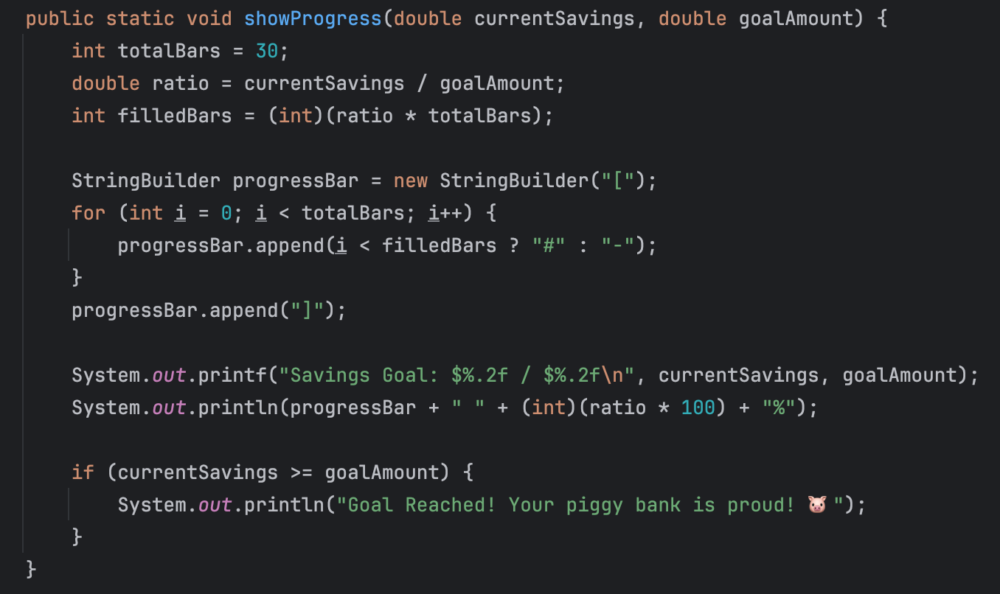
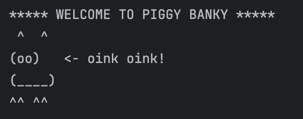
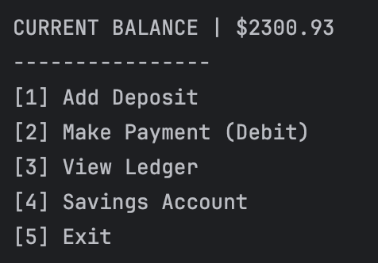
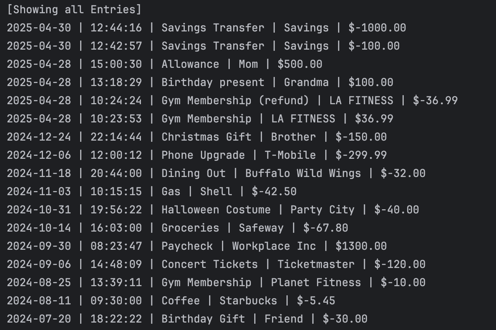
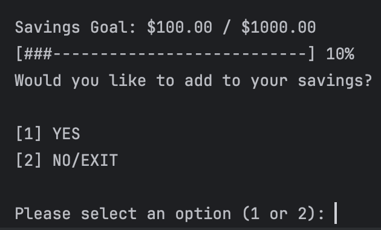

# 🐷 Project Name: Piggy Banky

Welcome to **Piggy Banky** a simple Java-based savings tracker and ledger app. Log deposits, payments, and view reports from your command-line piggy bank. Oink oink!

---

## 📋 Table of Contents

- [Overview](#overview)
- [Features](#features)
- [Usage](#usage)
- [Interesting Code Example](#interesting-code-example)
- [Screenshots](#screenshots)
- [Installation](#installation)
- [File Format](#file-format)
- [Credits](#credits)

---

## 📝 Overview

Piggy Banky is a command-line app written in Java that helps users:

- Track deposits and debits
- View all transactions in a ledger
- Filter by vendor, date, or transaction type
- Bonus: Monitor savings progress

---

## ⭐ Features

- [x] Add deposits and payments
- [x] View all transactions
- [x] Generate date and vendor-based reports
- [x] Track net savings

---

## 🚀 Usage

Once the app starts, you'll be greeted with a menu to then be able to nagivate to 
different parts of the application:

```
***** WELCOME TO PIGGY BANKY *****
 ^  ^
(oo)   <- oink oink!
(____)
^^ ^^

CURRENT BALANCE | $123.45
----------------
[1] Add Deposit
[2] Make Payment (Debit)
[3] View Ledger
[4] Savings Account
[5] Exit
```

---

## 📦 Interesting Code Example

### Savings Goal Tracker.java

```java
 public static void showProgress(double currentSavings, double goalAmount) {
        int totalBars = 30;
        double ratio = currentSavings / goalAmount;
        int filledBars = (int)(ratio * totalBars);

        StringBuilder progressBar = new StringBuilder("[");
        for (int i = 0; i < totalBars; i++) {
            progressBar.append(i < filledBars ? "#" : "-");
        }
        progressBar.append("]");

        System.out.printf("Savings Goal: $%.2f / $%.2f\n", currentSavings, goalAmount);
        System.out.println(progressBar + " " + (int)(ratio * 100) + "%");

        if (currentSavings >= goalAmount) {
            System.out.println("Goal Reached! Your piggy bank is proud! 🐷");
        }
    }
```
```markdown


```


### Save Transaction Format

Each transaction is saved in a CSV file using:

```java
String transactionLine = date + "|" + time + "|" + description + "|" + vendor + "|" + amount;
```

---

## 📊 File Format

Each transaction is stored in `transactions.csv` using this pipe-delimited format:

```
2025-04-28|15:42:10|Paycheck|Employer Inc|2000.00
2025-04-28|17:18:09|Groceries|Trader Joe's|-75.32
```

---

## 🖼️ Screenshots

```markdown


```


```markdown


```


```markdown


```


```markdown


```


---

## 🔧 Installation

1. Clone the repo:
   ```bash
   git clone https://github.com/igavila172/L2C_Capstone.git
   ```
2. Open the project in your IDE
3. Run `Main.java`

---

## 🙌 Credits

Created with ❤️ by Isaac Avila as part of a Year Up United - Pluralsight Java project.